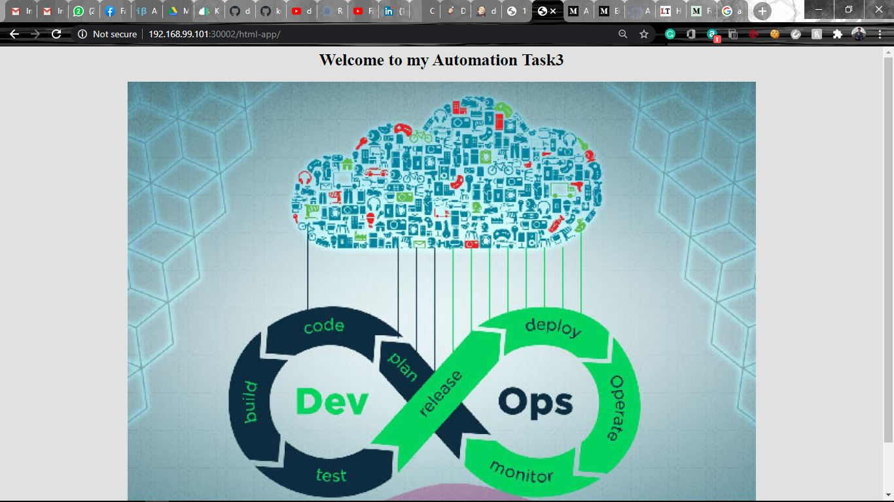
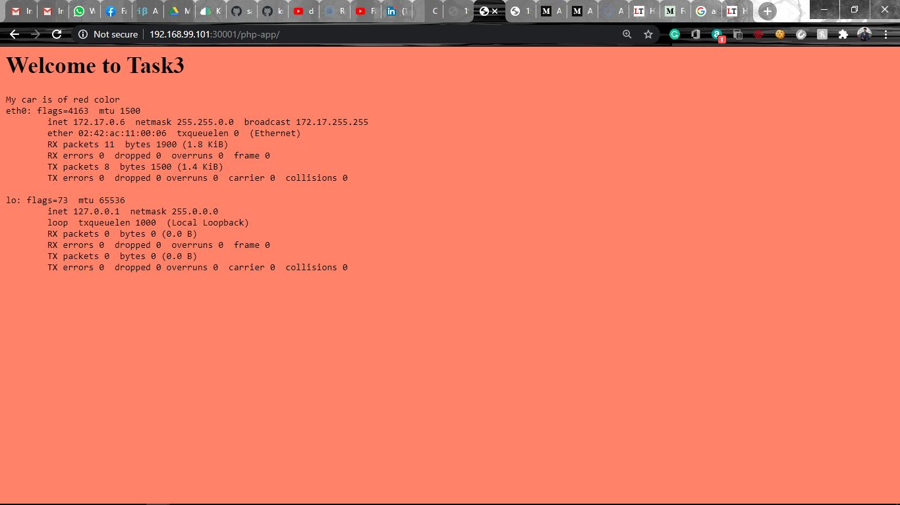

# Automating Kubernetes with Jenkins  

  

1. Create a job chain of Job 1, Job 2, Job 3 and Job 4 using build pipeline plugin in Jenkins  
2. __Job 1:__ Pull the Github repo automatically when some developers push the repo to Github.  
3. __Job 2 :__  
- By looking at the code or program file, Jenkins should automatically start the respective language interpreter installed image container to deploy code on top of Kubernetes( eg. If code is of PHP, then Jenkins should start the container that has PHP already installed )  
- Expose your pod so that testing team could perform the testing on the pod  
- Make the data to remain persistent ( If server collects some data like logs, other user information )  
4. __Job 3:__ Test your app if it is working or not.  
5. __Job 4:__ If the app is not working, then send email to the developer with error messages and redeploy the application after code is being edited by the developer  

### You can view the full Stepwise Implementation on my blog:  
https://medium.com/swlh/automating-kubernetes-with-jenkins-e6249bbcb3e#02f6-a2a284527016  

### Output Images from the HTML and PHP application:  

  

